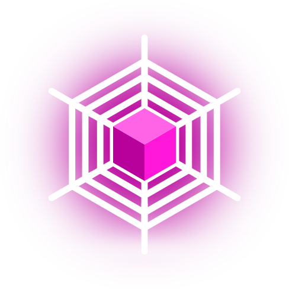

<a name="readme-top"></a>

[![Contributors][contributors-shield]][contributors-url]
[![Forks][forks-shield]][forks-url]
[![Stargazers][stars-shield]][stars-url]
[![Issues][issues-shield]][issues-url]
[![MIT License][license-shield]][license-url]

<!-- PROJECT LOGO -->
<br />
<div align="center">
  <a href="https://github.com/GaSOS-RO-IT-2022-2026/SpiderWeb">
    
  </a>

<h3 align="center">Spider Web</h3>

  <p align="center">
    A self hosted web interface for managing notes, events and announcements for you and your classmates.
    <br />
    <a href="https://github.com/GaSOS-RO-IT-2022-2026/SpiderWeb/tree/master/app"><strong>Explore source »</strong></a>
    <br />
    <br />
    <a href="https://discord.gg/sjqPXChTgt">Join Discord</a>
    ·
    <a href="https://github.com/GaSOS-RO-IT-2022-2026/SpiderWeb/issues">Report Bug</a>
    ·
    <a href="https://github.com/GaSOS-RO-IT-2022-2026/SpiderWeb/issues">Request Feature</a>
  </p>
</div>

<!-- TABLE OF CONTENTS -->
<details>
  <summary>Table of Contents</summary>
  <ol>
    <li>
      <a href="#about-the-project">About The Project</a>
      <ul>
        <li><a href="#built-with">Built With</a></li>
      </ul>
    </li>
    <li>
      <a href="#getting-started">Getting Started</a>
      <ul>
        <li><a href="#prerequisites">Prerequisites</a></li>
        <li><a href="#installation">Installation</a></li>
      </ul>
    </li>
    <li><a href="#usage">Usage</a></li>
    <li><a href="#roadmap">Roadmap</a></li>
    <li><a href="#contributing">Contributing</a></li>
    <li><a href="#license">License</a></li>
    <li><a href="#contact">Contact</a></li>
    <li><a href="#acknowledgments">Acknowledgments</a></li>
  </ol>
</details>

<!-- ABOUT THE PROJECT -->

## About The Project

![Spider Web Screen Shot][product-screenshot]

Spider Web is a self hosted web application for sharing notes and keeping track of exams, homework and other events.

It is written in Python 3.11.3 using Flask 2.2.3 and Psycopg2 (Postgres) as it's backend database.

<p align="center">
  <a href="https://skillicons.dev">
    
  </a>
</p>

<p align="right">(<a href="#readme-top">back to top</a>)</p>

### Built With

- [![Python][Python-shield]][Python-url]
- [![Flask][Flask-shield]][Flask-url]
- [![Postgres][Postgres-shield]][Postgres-url]
- [![Bootstrap][Bootstrap-shield]][Bootstrap-url]
- [![VueJS][Vue-shield]][Vue-url]

<p align="right">(<a href="#readme-top">back to top</a>)</p>

<!-- GETTING STARTED -->

## Getting Started

For development, you simply want to clone the repo, make a new python venv, install pip dependencies and run `make setup` to download external CSS and JS libraries.

If you want to self host the application, follow the steps below.

### Prerequisites

You will need Python >= 3.10 and pip installed.

- [python](https://www.python.org/)
- pip
  ```sh
  pip install --upgrade pip
  ```

### Installation

1. Get your Postgres database credentials
2. Create a database to be used with this application
   ```sh
   psql -U <username> -h <host> -p <port>
   CREATE DATABASE <database_name>;
   \l
   ```
3. Download external dependencies (JS, CSS)
   ```sh
   cd app
   make install
   ```
4. Rename the example env file
   ```sh
   mv ./example.env ./.env
   ```
5. Configure your settings in the envfile
   ```env
   DB_USER=root
   DB_PASS=root
   DB_HOST=localhost
   DB_PORT=5432
   DB_DATABASE=spiderweb
   SESSION_KEY=changemetosomethingrandom
   SESSION_LIFETIME=2880
   ```
6. Run the application
   ```sh
   make run
   ```

<p align="right">(<a href="#readme-top">back to top</a>)</p>

<!-- USAGE EXAMPLES -->

## Usage

Use this space to show useful examples of how a project can be used. Additional screenshots, code examples and demos work well in this space. You may also link to more resources.

_For more examples, please refer to the [Documentation](https://example.com)_

<p align="right">(<a href="#readme-top">back to top</a>)</p>

<!-- ROADMAP -->

## Roadmap

- [ ] Feature 1
- [ ] Feature 2
- [ ] Feature 3
  - [ ] Nested Feature

See the [open issues](https://github.com/GaSOS-RO-IT-2022-2026/SpiderWeb/issues) for a full list of proposed features (and known issues).

<p align="right">(<a href="#readme-top">back to top</a>)</p>

<!-- CONTRIBUTING -->

## Contributing

Contributions are what make the open source community such an amazing place to learn, inspire, and create. Any contributions you make are **greatly appreciated**.

If you have a suggestion that would make this better, please fork the repo and create a pull request. You can also simply open an issue with the tag "enhancement".
Don't forget to give the project a star! Thanks again!

1. Fork the Project
2. Create your Feature Branch (`git checkout -b feature/AmazingFeature`)
3. Commit your Changes (`git commit -m 'Add some AmazingFeature'`)
4. Push to the Branch (`git push origin feature/AmazingFeature`)
5. Open a Pull Request

<p align="right">(<a href="#readme-top">back to top</a>)</p>

<!-- LICENSE -->

## License

Distributed under the MIT License. See `LICENSE.txt` for more information.

<p align="right">(<a href="#readme-top">back to top</a>)</p>

<!-- CONTACT -->

## Contact

HyScript7 - [@hyscript7](https://twitter.com/twitter_handle) - hyscript7@gmail.com

Project Link: [https://github.com/GaSOS-RO-IT-2022-2026/SpiderWeb](https://github.com/GaSOS-RO-IT-2022-2026/SpiderWeb)

<p align="right">(<a href="#readme-top">back to top</a>)</p>

<!-- ACKNOWLEDGMENTS -->

## Acknowledgments

- []()

<p align="right">(<a href="#readme-top">back to top</a>)</p>

<!-- MARKDOWN LINKS & IMAGES -->
<!-- https://www.markdownguide.org/basic-syntax/#reference-style-links -->

[contributors-shield]: https://img.shields.io/github/contributors/GaSOS-RO-IT-2022-2026/SpiderWeb.svg?style=for-the-badge
[contributors-url]: https://github.com/GaSOS-RO-IT-2022-2026/SpiderWeb/graphs/contributors
[forks-shield]: https://img.shields.io/github/forks/GaSOS-RO-IT-2022-2026/SpiderWeb.svg?style=for-the-badge
[forks-url]: https://github.com/GaSOS-RO-IT-2022-2026/SpiderWeb/network/members
[stars-shield]: https://img.shields.io/github/stars/GaSOS-RO-IT-2022-2026/SpiderWeb.svg?style=for-the-badge
[stars-url]: https://github.com/GaSOS-RO-IT-2022-2026/SpiderWeb/stargazers
[issues-shield]: https://img.shields.io/github/issues/GaSOS-RO-IT-2022-2026/SpiderWeb.svg?style=for-the-badge
[issues-url]: https://github.com/GaSOS-RO-IT-2022-2026/SpiderWeb/issues
[license-shield]: https://img.shields.io/github/license/GaSOS-RO-IT-2022-2026/SpiderWeb.svg?style=for-the-badge
[license-url]: https://github.com/GaSOS-RO-IT-2022-2026/SpiderWeb/blob/master/LICENSE.txt
[product-screenshot]: images/screenshot.png
[Python-shield]: https://img.shields.io/badge/python-3670A0?style=for-the-badge&logo=python&logoColor=ffdd54
[Python-url]: https://www.python.org/
[Flask-shield]: https://img.shields.io/badge/flask-%23000.svg?style=for-the-badge&logo=flask&logoColor=white
[Flask-url]: https://flask.palletsprojects.com/en/2.3.x/
[Postgres-shield]: https://img.shields.io/badge/postgres-%23316192.svg?style=for-the-badge&logo=postgresql&logoColor=white
[Postgres-url]: https://www.postgresql.org/
[Bootstrap-shield]: https://img.shields.io/badge/Bootstrap-563D7C?style=for-the-badge&logo=bootstrap&logoColor=white
[Bootstrap-url]: https://getbootstrap.com
[Vue-shield]: https://img.shields.io/badge/Vue.js-35495E?style=for-the-badge&logo=vuedotjs&logoColor=4FC08D
[Vue-url]: https://vuejs.org/
